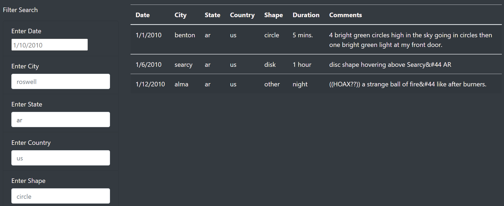
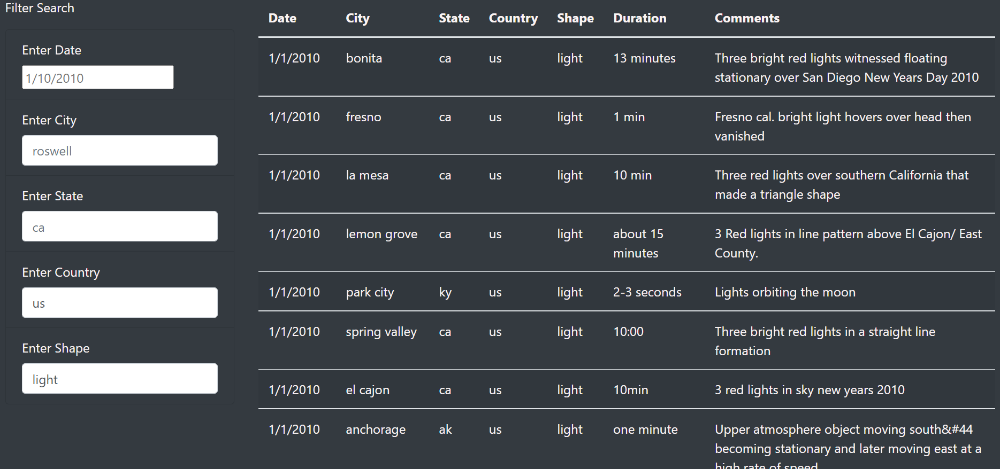

# UFOs
## Overview of Project
In this challenge I have built a dynamic webpage. Dynamic web pages are pages that will accept user inputs and visually adjust to reflect that interaction. Dynamic pages had built by inserting JavaScript into an HTML page also draw on knowledge of CSS and bootstrap and explore some Chrome dev tools to test the code as we go. 

In more concrete terms, I had built a table to hold and neatly displayed the data  wanted to work with. Then I added filters of the table which lets users refine their search on more than one level. For location-based data for example, a user can option to view results located in certain countries, or even cities. Our table has been inserted into, and visually displayed by an HTML page. I used basic HTML, Bootstrap and CSS to build and style the entire page. I  also included an attention-grabbing header, article summery and brief article. 

## Results
UFO Sightings

Filtering by a input value:

 - By Event Date:

     when user enters a date,updated table will display ,data with disired date
     
     
     
  - By city
  
      when user enters a city,updated table will display accordingly.
     
      
     
  - By state
  
     when user entres the disired state table will update and display accordingly.
     
      
      
 Filtering by multiple values:
 
  - By Country and shape
  
    when user enters country and shape updated table will display accordingly.
    
    )
     
  - Accordingly upto all fiter parameters can be entered.
     
     
## Summery

Draw backs of this web page:
- with this critirea only the user can filter data for singuler date.
- user has to memorize city state or country.
  Recormendation
  
  - It's recomended to add date range for filter funtion instead of one date.
  - Instead of looking at table and enter the disires city,state,country or shape valus if we can provide drop down box to select then it will be more user friendly.
